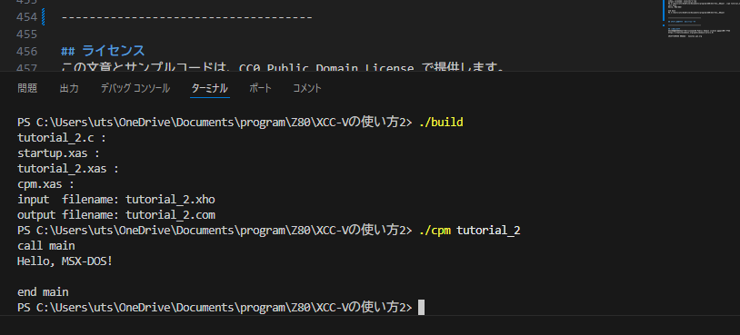

# 秋月電子で売っている Z80用 Cコンパイラ XCC-Vで CP/M / MSX-DOS で動くプログラムを作る
[秋月電子で売っている Z80用 Cコンパイラ XCC-Vの使い方](https://github.com/KyoichiSato/akizuki-Z80-C-tutorial1) の続きです。

前回 Cのソースを、コンパイル - アセンブル - リンクして実行可能なバイナリ情報を出力できるようになりました。
今回は CP/M / MSX-DOS で動作するプログラムを作ってみます。

MSX-DOSのファンクションコールは CP/Mの上位互換で、MSX-DOSで CP/Mのプログラム動作します。この文章本文では CP/Mと表記していますが、MSX-DOSでも同じように動作します。


## 目次
1. [CP/M / MSX-DOSから起動できるようにする](#CPM--MSX-DOSから起動できるようにする)
1. [BDOSコールを C言語から使えるようにする](#BDOSコールを-C言語から使えるようにする)
    * [アセンブラモジュールとの結合](#アセンブラモジュールとの結合)
    * [BDOSコール関数](#BDOSコール関数)
1. [Intel HEX形式を COM形式に変換](#Intel-HEX形式を-COM形式に変換)
1. [ビルドする](#ビルドする)
1. [CP/Mシステムコールの資料](#CPMシステムコールの資料)
1. [この文章のライセンス](#ライセンス)

### 別頁
- [秋月電子で売っている Z80用 Cコンパイラ XCC-Vの使い方](https://github.com/KyoichiSato/akizuki-Z80-C-tutorial1)
- [CP/M / MSX-DOSで標準入出力とファイル入出力を使えるようにする](https://github.com/KyoichiSato/akizuki-Z80-C-tutorial3)

------------------------------------

## CP/M / MSX-DOSから起動できるようにする
### リンクパラメータファイルの編集
CP/Mのプログラムはアドレス `0x0100`番地にロードされて実行されるので、プログラムが `0x0100`
 番地から配置されるようにリンクパラメータファイルを編集します。

#### tutorial_2.xls
```
;-------------------------------+
;       RAM Area                |
;-------------------------------+
; CP/Mなので全部RAMに配置
/ADDR=0100
/SECT=C_START   ; 0100Hからスタートアッププログラムを配置
/SECT=C_*|CODE
/SECT=I_*
/SECT=D_*|COMM          (data   =_DATA)
/SECT=B_*|COMM          (bss    =_BSS)
/init_section = _INIT_DATA      (_DATA)
/SECT=_STACK

;-------------------------------+
;       linkage module          |
;-------------------------------+
/Syslib=C:\akiz80\LIB\z80\CS\CSZE1.XLB          ; 基本？ライブラリ（計算や最適化で呼び出される）
/Syslib=C:\akiz80\LIB\z80\STD\STDZE1.XLB        ; C言語の標準ライブラリ
/Syslib=C:\akiz80\LIB\z80\MATH\MATZE1.XLB       ; 数学ライブラリ
;リンカがかしこくて、システムライブラリは使用する関数のみリンクされる。
;使用しない分はリンクされないので、システムライブラリは指定しっぱなしでよい。

/Name=tutorial_2        ; 出力オブジェクト名
/Entry_Name=startup     ; 実行開始オブジェクト名

; リンクするオブジェクトを列記する。拡張子を省略すると ".xao"
/Module=startup
/Module=tutorial_2
/Module=cpm
```
すべてのセクションを RAMに配置しています。
マニュアルに CP/Mのことは何も書かれていないのですが、やってみると簡単でした。

### スタートアッププログラム
CP/M のファンクションコール (BDOSコール) の動作確認で文字を表示してみます。

まずは、なるべく簡単に実行してみたかったので、
アセンブリで書かれているスタートアッププログラムに直接追記して文字を表示させてみました。

#### startup.xas
```
（略）
;*** call main ***  main 関数の起動

        ; 動作確認で文字を出力してみる
        ld	C,09H	; CP/M 文字列出力
        ld	DE,STR1$        ; 最後に '$' を付けるとローカルラベル
        call	0005H	; BDOS CALL


        extnal  _main
        call    _main	; main関数実行

        ld	C,09H	; CP/M 文字列出力
        ld	DE,STR2$
        call	0005H	; BDOS CALL

        jp	0	; CP/M ウォームスタート
STR1$:	db	'call main',0DH,0AH,'$' ; 0DH:CR 0AH:LF 文字列の終端記号は '$'
STR2$:	db	0DH,0AH,'end main$'
```
main関数呼び出しの前後に文字列表示を追加しました。
こんな簡単な変更で、ちゃんと文字が表示されました。

------------------------------------

## BDOSコールを C言語から使えるようにする
アセンブリ言語のプログラムから CP/Mのシステムコールを使って文字列を表示することができたので、
こんどは C言語から CP/Mのシステムコールを使えるようにします。

CPUのレジスタに値をセットして特定のアドレスをコールするには、アセンブリ言語でプログラムを書く必要があります。
このコンパイラでは C言語のプログラムの中でインラインアセンブラも使えるのですが、
Cの変数を簡単に参照する方法を見つけられなかったので、
別にアセンブリ言語で書いた関数を C言語から呼び出すことにしました。

### アセンブラモジュールとの結合
C言語からアセンブリ言語のプログラムを呼び出したり、逆にアセンブリ言語のプログラムからC言語のプログラムを呼び出したりする方法は、Cコンパイラのマニュアルの 「アセンブラモジュールとの結合」 に書かれていましたので、ここに簡単にまとめておきます。

### レジスタ
IX, SPレジスタは保存しなければなりません。

AF, BC, DE, HL, IYレジスタは破壊してかまいません。

### 引数
関数の引数はスタックで渡します。引数が少ない場合でもレジスタは使われません。

### 関数を呼ぶ側
関数を呼び出す際には、引数を右から順にスタックに積んでコールします。

```
関数呼び出しの例
func(arg1, arg2, arg3);　のとき

      PUSH arg3         ; 引数を右から順に PUSH
      PUSH arg2
      PUSH arg1
      CALL _func        ; 関数をコール
ADDR: POP xx
      POP xx            ; 関数から戻ってきたら
      POP xx            ; 引数をPUSHしたのと同じだけPOPしてスタックをもとに戻す
```
引数が多い場合は、関数コール前に SPレジスタの値をを退避して、
関数から戻ってから POPの代わりに退避した値を SPレジスタに復帰してもよい。

### 呼び出される側の関数
#### Z80の命令のおさらい

* CALL命令は CALL命令の次のアドレス（リターンアドレス）をスタックに PUSHしてからジャンプする
* PUSH命令は SP-2してから SP+0に値L、 SP+1に値H を格納する
* POP命令は SP+0から値L、SP+1から値H を取り出してから SP+2する

関数を CALLした直後のスタックの状態は次のようになっている。

```
func(arg1, arg2, arg3); として関数を呼び出した場合

SP+0 リターンアドレス L
SP+1 リターンアドレス H
SP+2 arg1 L
SP+3 arg1 H
SP+4 arg2 L
SP+5 arg2 H
SP+6 arg3 L
SP+7 arg3 H


引数を取り出すために、
PUSH IX を実行してフレームポインタ IXを退避すると

SP+0 IX L
SP+1 IX H
SP+2 リターンアドレス L
SP+3 リターンアドレス H
SP+4 arg1 L
SP+5 arg1 H
SP+6 arg2 L
SP+7 arg2 H
SP+8 arg3 L
SP+9 arg3 H

となるので IXに SPをロードして

LD L,(IX+4)
LD H,(IX+5)
のようにして1つ目の引数を

LD C,(IX+6)
LD B,(IX+7)
のようにして2つ目の引数を取り出すことができる。
```

### 戻り値
関数の戻り値は BCレジスタで返します。

### BDOSコール関数
CP/Mのファンクションコール （BDOSコール） を行う関数を MSX-Datapackを見ながらアセンブリ言語で作りました。

#### cpm.xas
```
（略）
BDOS    EQU     0005H
C_CPM   SECT    CODE

; CP/M ウォームリセット
_CPMRESET:
        LD      C,00H
        CALL    BDOS    ; (OSをリスタートするので、戻ってこない)
        RET
        
; CP/M コンソール入力
_CPMGETC:
        PUSH    IX      ; BDOSコールでIXが破壊されるかもしれないので、退避しておく
        LD      C,01H
        CALL    BDOS
        LD      C,A     ; A入力文字
                        ; C関数の戻り値は C/BC/BC,DEを使う
        POP     IX      ; IX, SPを破壊してはいけない
        RET

; CP/M コンソール出力
_CPMPUTC:
        PUSH	IX
        LD      IX,0	;
        ADD     IX,SP	; IX=SP フレームポインタの設定

                        ; (IX+4) 1つ目の引数 下位1バイト
                        ; （char型でも引数をスタックに積む関係で2バイト分の空間を使う）
        LD      E,(IX+4) ; E出力文字
        LD      C,02H
        CALL	BDOS
        POP     IX
        ; ローカル変数などのためにSPを変更していたらもとに戻してからリターンする
        RET
（略）
```

#### cpm.h
```
（略）
/* CP/M 0x00 ウォームリセット */
void CPMRESET(void);

/* CP/M 0x01 コンソール入力 入力があるまで待つ
    戻り値 入力文字 */
char CPMGETC(void);

/* CP/M 0x02 コンソール出力
    c 出力文字 */
void CPMPUTC(char c);

/* CP/M 0x03 補助入力
    戻り値 入力文字 */
char CPMAUXGETC(void);

/* CP/M 0x04 補助出力
    c 出力文字 */
void CPMAUXPUTC(char c);

/* CP/M 0x07 直接コンソール入力 ※MSX-DOSのみ
    戻り値 入力文字 入力のエコーバック、コントロールキャラクタの処理は行わない。 */
char CPMCONPUTC(void);

/* CP/M 0x08 エコーなしコンソール入力 ※MSX-DOSのみ
    C 出力文字 エコーバックは行わない。コントロールキャラクタは処理する。 */
void CPMRAWGETC(char c);

/* CP/M 0x09 文字列出力
    文字列の終端は '$' C言語と異なるので注意。
    Ctrl-S や Ctrl-C の入力を受け付ける。 */
void CPMPUTS(char *str);
（略）
```
Cのヘッダファイルはこんな感じ。

```
#include "cpm.h"

main()
{
   CPMPUTS("Hello! MSX-DOS!!\r\n$");
}
```
このように、 Cから CP/Mのファンクションコールを使うことができます。

文字の表示ができるようになると楽しくなってきます。

------------------------------------

## Intel HEX形式を COM形式に変換
プログラムをビルドして出力された Intel HEX形式のファイルを、
CP/Mで実行できる COM形式に変換するプログラムを Pythonで作りました。

#### hex2com.py
```
#
# HEX2COM
# IntelHexファイルを MSX-DOS / CP/M の COMファイルに変換する
#
# This code is provided under a CC0 Public Domain License.
# http://creativecommons.org/publicdomain/zero/1.0/
# 
# 2024年12月03日 佐藤恭一 kyoutan.jpn.org

import sys,os
from intelhex import IntelHex

def usage():
    print('HEX2COM        kyoutan.jpn.org')
    print('Convert IntelHex format files to MSX-DOS / CP/M COM format.')
    print('')
    print('HEX2COM <filename> [-d] [-h]')
    print('    -d Hexadecimal dump view')
    print('    -h Show Help')

args=sys.argv
filename=''
option=''

# コマンドライン引数が無ければ使い方を表示して終了
if 1==len(args):
    usage()
    sys.exit()

# コマンドライン引数をしらべる
for i, arg in enumerate(args):
    if i==0:
        continue    # ゼロ番目の引数（コマンド名）はなにもしない
    
    #print(f'引数 {i}: {arg}')
    if not arg.startswith('-'):
        filename=arg                    # 一文字目が '-'ではないときはファイル名として扱う
    elif arg.upper().startswith('-H'):
        #print('-H')
        usage()
        sys.exit()
    elif arg.upper().startswith('-D'):
        #print('-D')
        option='DUMP'

# コマンドライン引数を調べたけどファイルネームが無いので終了
if ''==filename:
    #print('ファイルネームがない')
    usage()
    sys.exit()

print('input  filename:',filename)
# IntelHexファイルを読み込む
hexfile=IntelHex(filename)

# -D オプションならダンプ表示だけを行って終了
if 'DUMP'==option:
    hexfile.dump()
    sys.exit()

if 0x100!=hexfile.minaddr():
    # アドレスが 0x100から始まっていない場合は処理中止
    print('The start address was not 0x100, so no processing was performed.')
    sys.extt()

# バイナリファイルを書き出し
outputfilename=os.path.splitext(filename)[0]+'.com'
print('output filename:',outputfilename)
hexfile.tobinfile(outputfilename)
sys.exit()
```
Python簡単でいいね！

### Pythonのインストール方法
Windows 10以降で Pythonをインストールするには、ターミナルで
```
> winget install python
```
とするだけ。とても簡単です。

`hex2com.py` を使用する場合、
Pythonをインストール後に `hex2com.py` で使用している
`intelhex` ライブラリを、ターミナルから
```
> pip install intelhex
```
として、インストールしてください。

`hex2com.py` は、ターミナルで
```
> python hex2com.py tutorial_2.xho
```
のようにして使うことができます。

------------------------------------

## ビルドする
#### build.bat
```
@echo off

REM 最適化の ON/OFF
SET OPTIMIZE=OFF

REM XCCVをインストールしたフォルダを指定
SET XCC_PATH=C:\akiz80\

REM 環境変数をセット
REM （バッチファイル内でセットした環境変数は、バッチファイルの処理が終了すると破棄される）
SET PATH=%PATH%;%XCC_PATH%bin\
SET XCC_DEFINE=%XCC_PATH%GEN\CXGZE1.XCO
SET XCC_INCLUDE=%XCC_PATH%INCLUDE\
SET XAS_DEFINE=%XCC_PATH%GEN\VXGZE1.XGO
SET XAS_ERRMSG=%XCC_PATH%BIN\XASMSG.SJIS
SET XAS_LIB=%XCC_PATH%LIB\z80\
SET XAS_CODE=sjis
SET XAS_MPUNAME=z80

REM コンパイル
IF "%OPTIMIZE%"=="ON" (
xccv tutorial_2.c -d -O o -w -LW1 -LE2 -ks
) ELSE (
xccv tutorial_2.c -d -w -LW1 -LE2 -ks
)

REM アセンブル
xassv startup.xas -da -a -r
xassv tutorial_2.xas -da -a -r
xassv cpm.xas -da -a -r

REM リンク（リンク情報は .xlsファイルに記述する）
xlnkv tutorial_2.xls -l -m -d -s -o -p

REM 出力オブジェクトをインテルHEX形式に変換
xoutv tutorial_2.xlo -d -t obj1,sym1 -l 

REM インテルHEXを MSX-DOS / CP/M の COMファイルに変換
python hex2com.py tutorial_2.xho
```
`cpm.xas` が増えたので、ビルド用のバッチファイルを修正しました。

Cで BDOSコールを使う、ごく簡単なプログラムを書いて実際にビルドして実行してみます。
```
#include "cpm.h"

main()
{
    CPMPUTS("Hello, MSX-DOS!\r\n$"); /* 文字列の終端文字 '$'を忘れないように */
    return;
}
```

[TAKEDAさんの CP/M Player for Win32](http://takeda-toshiya.my.coocan.jp/)を使うと、
Windowsのターミナルで CP/Mのプログラムを実行できるので、動作テストにとても便利です。

`build.bat` を実行すると

こんな感じでビルドされます。

`./cpm tutorial_2` とすると、CP/M Playerでプログラムの実行もちゃんとできました。
CP/M Playerをソースコードと同じディレクトリに置いて実行しています。

------------------------------------

## CP/Mシステムコールの資料
CP/Mのプログラムを書くのに参考になる書籍です。

### MSX-DOS / CP/Mのシステムコール一覧
* MSX2 Technical Hand book
* MSX-DOS TOOLS
* MSX-Datapack
* SHARP X1 turbo用 turbo CP/M ユーザーズマニュアル

### CP/Mのシステムコールの実際の使用例
* 応用 CP/M

------------------------------------

## ライセンス
この文章とサンプルコードは、CC0 Public Domain License で提供します。
https://creativecommons.org/publicdomain/zero/1.0/

2025年2月5日 佐藤恭一 kyoutan.jpn.org
